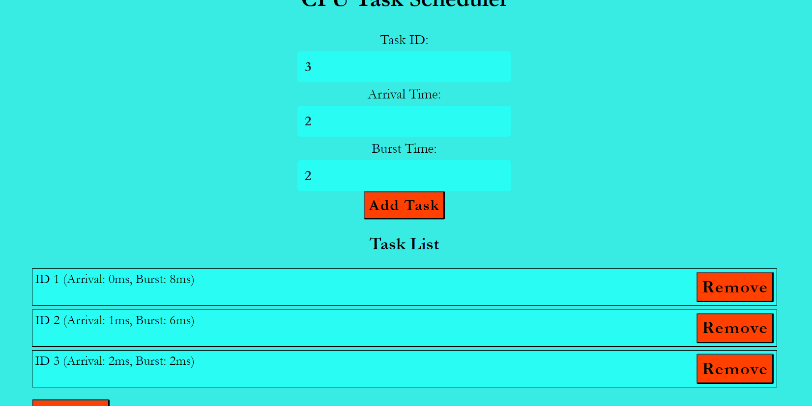

# CPU Task Scheduler

## Project Description
This project implements a CPU Task Scheduler that allows users to input task details through a webpage, schedules the tasks, and displays the scheduling statistics.
A new algorithm named Ratio based scheduling algorithm is discussed.
The webpage also shows statistics for other scheduling algorithms like First-Come-First-Serve (FCFS), Round Robin (RR) and Shortest Job Next (SJN). The backend of the project is implemented using Node.js, and it runs on port 5000. The task scheduler logic is written in C++.

## How to Run the Project
- ## Project directory structure
  - proj_dir/
    - server.js
    - TaskScheduler.cpp
    - scheduler (created after compilation)
    - public/
        - index.html
        - styles.css
        - scripts.js
- ## Dependencies
  - Node.js v20.14.0 ([download](https://nodejs.org/en))
  - framework: Express v4.19.2
    ```console
    npm install express
    ```
    This will add Express to node_modules and updates package.json and package-lock.json
  - g++ (GNU Compiler Collection)
- ## Steps to Execute the Code
  ### 1. Compile the C++ Code:
  Open a terminal and navigate to the project directory (**proj_dir**). Run the following command to compile the **TaskScheduler.cpp** file:
  ```console
  g++ TaskScheduler.cpp -o scheduler
  ```
  This command creates an executable file named **scheduler.exe** in the **proj_dir**.

  ### 2. Run the Node.js Server:
  With the terminal still in the project directory, run the following command to start the "Node.js" server:
  ```console
  node server.js
  ```
  The server will start and listen on port-5000.

  ### 3. Access the Frontend:
  Open a web browser and navigate to
  ```arduino
  localhost:5000
  ```
  This will load the frontend interface where you can input task details and view scheduling statistics. 


## Working of the Project

  ### Task Input and Scheduling:
  User creates a list of tasks by inputing task details such as task id, arrival time, and burst time through the webpage. These details are sent to the Node.js server, which then uses the compiled C++ executable (scheduler) to perform the scheduling.

  ### Scheduling Algorithms Implemented:
  - **Ratio-Based Scheduling** (ratio_based_schedule): Prioritizes tasks based on the ratio of remaining burst time to waiting time.
  - **Shortest Job First** (sjf_schedule): Schedules tasks based on the shortest burst time.
  - **First-Come, First-Served** (fcfs_schedule): Schedules tasks in the order of their arrival.
  - **Round-Robin** (rr_schedule): Implements round-robin scheduling with a fixed time quantum.
  ### Displaying Statistics:
  The results of the scheduling (including task order, start and finish times) and comparative statistics for FCFS, RR and SJN algorithms are displayed on the webpage.

  ### Execution Flow
  - Users input task details in the form on index.html.
  - The input data is sent to the backend using JavaScript.
  - The Node.js server (server.js) receives the input data and writes it to a file.
  - The server then executes the scheduler executable, passing the input data file (**input.txt**) as an argument.
  - The C++ program reads the input, performs the scheduling, and writes the results to std::out.
  - The Node.js server captures the outputs and sends the results back to the frontend.
  - The frontend receives the scheduling results and displays them, along with comparative statistics.

### Explanation of Ratio based Scheduler Algorithm
The ratio-based scheduling algorithm aims to prioritize tasks based on a ratio calculated dynamically during execution. This ratio considers both the remaining burst time of a task and its waiting time (time spent waiting to be executed).
#### Implementation Breakdown

##### 1. Function Signature and Variables
```cpp
void ratio_based_schedule(vector<Task>& tasks, vector<pair<int, int>>& schedule)
```
  - Parameters:
    - tasks: A vector of Task structures representing the tasks to be scheduled.
    - schedule: A vector of pairs (time, task_id) to store the schedule timeline.
##### 2. Initialization
```cpp
int n = tasks.size();
vector<int> rt(n);  // Remaining time for each task
```
  - n: Number of tasks.
  - rt: Array to store remaining burst time for each task.
##### 3. Main Loop - Scheduling Process
```cpp
int complete = 0, t = 0;
int finish_time;
bool check = false;

while (complete != n) {
    double min_ratio = numeric_limits<double>::max();
    int shortest = 0;
```
  - Variables:
    - complete: Counter for completed tasks.
    - t: Current time.
    - finish_time: Time when a task finishes.
    - check: Flag to indicate if a suitable task has been found.
    - min_ratio: Variable to store the minimum ratio found initially set to a large value (double::max()).
    - shortest: Index of the task with the minimum ratio.
##### 4. Finding the Task with Minimum Ratio
```cpp
    for (int j = 0; j < n; j++) {
        if ((tasks[j].arrival_time <= t) && rt[j] > 0) {
            double ratio = static_cast<double>(rt[j]) / (t - tasks[j].arrival_time + 1);
            if (ratio < min_ratio) {
                min_ratio = ratio;
                shortest = j;
                check = true;
            }
        }
    }
```
##### 5. Loop Explanation:
  - Iterate through each task (j) to find tasks that have arrived (arrival_time <= t) and still have remaining burst time (rt[j] > 0).
  - Calculate the ratio for each eligible task using the formula:
```cpp
ratio = remaining_time / (current_time - arrival_time + 1)
```
  - Update shortest to the index of the task with the smallest ratio.
##### 6. Task Selection and Scheduling
```cpp
    if (!check) {
        t++;
        continue;
    }

    if (schedule.empty() || schedule.back().second != tasks[shortest].task_id) {
        schedule.push_back({t, tasks[shortest].task_id});
    }

    rt[shortest]--;
```
##### 7. Selection Process:
  - If no suitable task is found (check == false), increment t (time) and continue the loop.
  - If a task is selected (check == true), check if the task is already scheduled (schedule.back().second != tasks[shortest].task_id). If not, push the task into the schedule.
  - Reduce the remaining burst time (rt[shortest]--) for the selected task.
##### 8. Completion and Waiting Time Calculation
```cpp
    if (rt[shortest] == 0) {
        complete++;
        check = false;
        finish_time = t + 1;
        tasks[shortest].waiting_time = finish_time - tasks[shortest].burst_time - tasks[shortest].arrival_time;
        if (tasks[shortest].waiting_time < 0)
            tasks[shortest].waiting_time = 0;
    }
    t++;
```
  - Completion Check:
    - If the remaining burst time of the selected task becomes zero (rt[shortest] == 0), mark the task as completed (complete++).
    - Calculate the finish time and waiting time for the completed task.
    - Adjust waiting time to ensure it is non-negative.
##### 9. Updating Turnaround Time
```cpp
for (int i = 0; i < n; i++) {
    tasks[i].turnaround_time = tasks[i].burst_time + tasks[i].waiting_time;
}
```
  - Turnaround Time Calculation:
    - Calculate turnaround time (burst_time + waiting_time) for each task after scheduling completes.

#### When is Ratio based Algorithm better than SJF?
##### Scenario 1: Preventing Starvation
  - SJF Schedule: SJF can cause starvation for long tasks if short tasks keep arriving, as long tasks might never get executed.
  - Ratio-Based Schedule: By factoring in the waiting time, the ratio-based algorithm can prevent starvation by gradually increasing the priority of longer-waiting tasks, ensuring they eventually get processed.
##### Scenario 2: Mix of Long and Short Tasks
  - SJF Schedule: In environments with a mix of long and short tasks, SJF might lead to longer average turnaround times for long tasks, as they are continuously preempted by shorter tasks.
  - Ratio-Based Schedule: The ratio-based approach can better handle this mix by balancing the priority given to short and long tasks based on their waiting times, improving fairness and potentially reducing average waiting time for longer tasks.
### Learning Takeaways
From this project, I learned:
  - How to integrate C++ code with a Node.js backend.
  - The implementation of a new algorithm.
  - Comparison of custom algoritm with different CPU scheduling algorithms.
  - How to handle asynchronous operations in JavaScript to communicate between the frontend and backend.
  - The process of executing C++ programs from within a Node.js application.
  - This project provided a comprehensive understanding of both backend and frontend development, as well as insights into CPU scheduling algorithms.
### Resources
  - [Youtube playlist](https://www.youtube.com/playlist?list=PLBlnK6fEyqRitWSE_AyyySWfhRgyA-rHk)
  - https://www.geeksforgeeks.org/program-for-shortest-job-first-or-sjf-cpu-scheduling-set-1-non-preemptive/
  - https://www.w3schools.com/nodejs/
